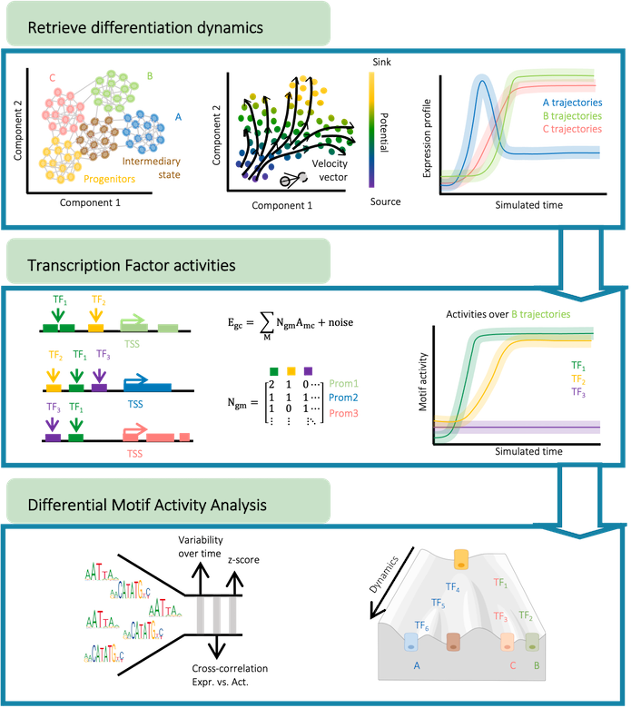

# FateCompass

FateCompass is a flexible pipeline to estimate dynamic **stochastic trajectories** of gene expression and **transcription factor activities** during **cell-fate decision** using **single-cell RNA seq data**. We combined a probabilistic framework with RNA velocities ([La Manno et al. 2018](https://doi.org/10.1038/s41586-018-0414-6) and [Bergen et al. 2020](https://doi.org/10.1038/s41586-018-0414-6)) or a differentiation potential to estimate transition probabilities and perform stochastic simulations. Also, we implemented a linear model of gene regulation ([Balwierz et al.2014](http://www.genome.org/cgi/doi/10.1101/gr.169508.113)) to learn transcription factor activities. Taking into account dynamic changes and correlations, we identified lineage-specific regulators. The FateCompass pipeline consist of three main steps summarized in the figure below:

:soon: **Python version and tool implementation coming soon!**

## Table of Contents

- [Reproducibility](#reproducibility)
- [Tutorial](#tutorial)
- [Pre-print](#pre-print)

## Reproducibility 

[(Back to top)](#table-of-contents)

The FateCompass methodology was tested with two datasets of pancreatic endocrine cell differentiation. Scripts to reproduce the results are available in the [reproducibility](reproducibility/scripts/) folder and are implemented in Matlab. There are two scenarios: **(i)** RNA velocity driven trajectories and **(ii)** Differentiation potential driven trajectories. 

In general, the scripts should be run in the following order: 

1. differentiation_trajectories.m
2. tf_activities.m 
3. bootstrapping.m 
4. differential_motif_activity_analysis.m

FateCompass results for these datasets are summarized for easy visualization in the following [Shiny App](https://jimenezs.shinyapps.io/FateCompass_results/). 

## Tutorial 

[(Back to top)](#table-of-contents)

Templates to run FateCompass with your own data will be available in the [tutorial](tutorial/) folder. Further instructions coming soon :soon:. 

## Pre-print

[(Back to top)](#table-of-contents)

Please check our pre-print [Jimenez et al. 2022](https://doi.org/10.1101/2022.04.01.486696) to learn more. 