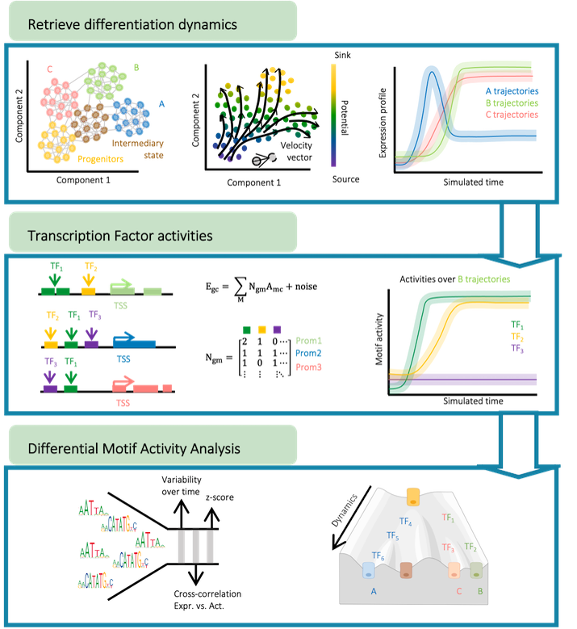
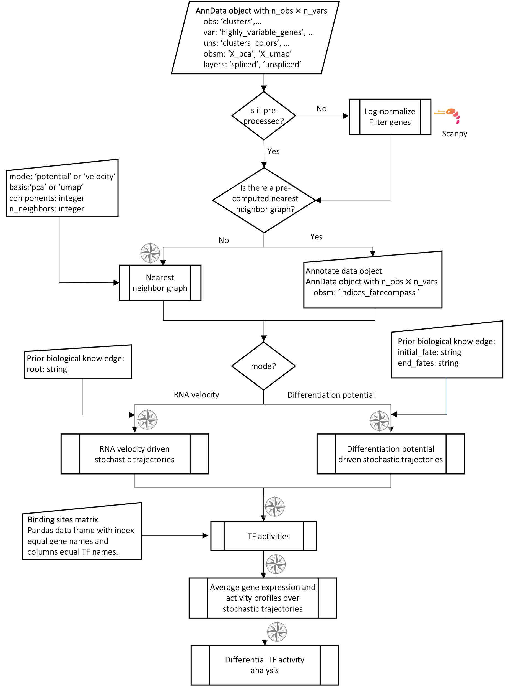

# FateCompass

FateCompass is a flexible pipeline to estimate dynamic **stochastic trajectories** of gene expression and **transcription factor activities** during **cell-fate decision** using **single-cell RNA seq data**. We combined a probabilistic framework with RNA velocities ([La Manno et al. 2018](https://doi.org/10.1038/s41586-018-0414-6) and [Bergen et al. 2020](https://doi.org/10.1038/s41586-018-0414-6)) or a differentiation potential to estimate transition probabilities and perform stochastic simulations. Also, we implemented a linear model of gene regulation ([Balwierz et al.2014](http://www.genome.org/cgi/doi/10.1101/gr.169508.113)) to estimate transcription factor activities. Taking into account dynamic changes and correlations, we identified lineage-specific regulators. The FateCompass pipeline consist of three main steps summarized in the figure below:



## Table of Contents

- [Pre-print](#pre-print)
- [Tutorial](#tutorials)
- [Reproducibility](#reproducibility)

## Pre-print

[(Back to top)](#table-of-contents)

Please check our pre-print [Jimenez et al. 2022](https://doi.org/10.1101/2022.04.01.486696) to learn more.

## Tutorials

[(Back to top)](#table-of-contents)

FateCompass is fully implemented in python. The main input of FateCompass are: **(i)** a pre-processed data object (adata), with annotations of at least cell types (‘clusters’) and optionally the RNA velocity field, and **(ii)** a TFs binding sites matrix, where the columns are the TFs or motifs and the rows are the expressed genes. We suggest performing basic pre-processing using [Scanpy](https://scanpy.readthedocs.io/en/stable/) and [scVelo](https://scvelo.readthedocs.io/en/stable/).

To be able to run FateCompass, we suggest to create a conda environment with all the dependencies using the provided .yml file.

```
conda env create -f fatecompass.yml
```

The FateCompass module is provided in the fatecompass.py file.

We provide three main [tutorials](tutorials/) as documented jupyter notebooks:

1. fatecompass_basics_rna_velocity.ipynb
2. fatecompass_basics_differentiation_potential.ipynb
3. fatecompass_sanity_network.ipynb

The following flowchart illustrates the input and output of each one of the steps of the FateCompass pipeline.



## Reproducibility

[(Back to top)](#table-of-contents)

The FateCompass methodology was tested with two datasets of pancreatic endocrine cell differentiation. Scripts to reproduce the results are available in the [reproducibility](reproducibility/scripts/) folder and are implemented in Matlab. There are two scenarios: **(i)** RNA velocity driven trajectories and **(ii)** Differentiation potential driven trajectories.

In general, the scripts should be run in the following order:

1. differentiation_trajectories.m
2. tf_activities.m
3. bootstrapping.m
4. differential_motif_activity_analysis.m

FateCompass results for these datasets are summarized for easy visualization in the following Shiny App: https://jimenezs.shinyapps.io/FateCompass_results/.
